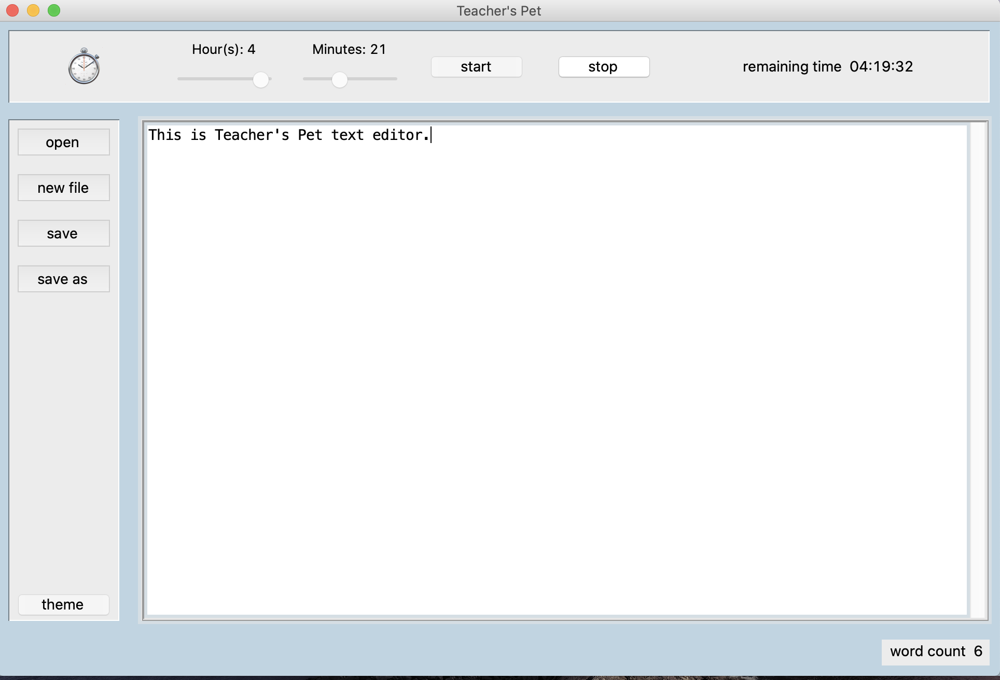

# Teachers_pet
Teacher's Pet is a developing project to provide educators with handy grading and creating reports tools.
Teachers_pet_text_editor is a part of the Teacher's Pet project. 
It features:  
timer,
word count,
open file,
new file,
save file ('file saved' appears at the SW corner when a file saved successfully)
save as,
theme, 
showing a warning if a file is not saved before closing.

There are other functions currently under development.

